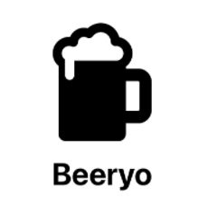

<!--
*** README was created using Best-README-Template. 
*** https://github.com/othneildrew/Best-README-Template
*** Thank you Drew for this!
-->

<!-- PROJECT SHIELDS -->
<!--
*** I'm using markdown "reference style" links for readability.
*** Reference links are enclosed in brackets [ ] instead of parentheses ( ).
*** See the bottom of this document for the declaration of the reference variables
*** for contributors-url, forks-url, etc. This is an optional, concise syntax you may use.
*** https://www.markdownguide.org/basic-syntax/#reference-style-links
-->
[![Contributors][contributors-shield]][contributors-url]
[![Forks][forks-shield]][forks-url]
[![Stargazers][stars-shield]][stars-url]
[![Issues][issues-shield]][issues-url]
[![MIT License][license-shield]][license-url]

<!-- PROJECT LOGO -->
 

  

<h3 align="center">Beeryo</h3>

  

    My first iOS App that allows user to store brewing recipes.
     
    <a href="https://github.com/lamehunter/Beeryo/"><strong>Explore the docs »</strong></a>
     
     
    <a href="https://github.com/lamehunter/Beeryo/issues">Report Bug</a>
    ·
    <a href="https://github.com/lamehunter/Beeryo/issues">Request Feature</a>
  

<!-- TABLE OF CONTENTS -->

  
Table of Contents

  <ol>
    <li>
      <a href="#about-the-project">About The Project</a>
    </li>
    <li><a href="#contributing">Contributing</a></li>
    <li><a href="#license">License</a></li>
    <li><a href="#contact">Contact</a></li>
  </ol>

<!-- ABOUT THE PROJECT -->
## About The Project

The idea was to create some simple app where UI is friendly to the user and app itself is stripped down from the advanced features.

Still in the process of development, it's not easy to work 9-18 and then learn something new after!
    
CoreData might be an overkill for such an app but this was only done to learn something new.

(<a href="#top">back to top</a>)

<!-- CONTRIBUTING -->
## Contributing

Contributions are what make the open source community such an amazing place to learn, inspire, and create. Any contributions you make are **greatly appreciated**.

If you have a suggestion that would make this better, please fork the repo and create a pull request. You can also simply open an issue with the tag "enhancement".
Don't forget to give the project a star! Thanks again!

1. Fork the Project
2. Create your Feature Branch (`git checkout -b feature/AmazingFeature`)
3. Commit your Changes (`git commit -m 'Add some AmazingFeature'`)
4. Push to the Branch (`git push origin feature/AmazingFeature`)
5. Open a Pull Request

(<a href="#top">back to top</a>)

<!-- LICENSE -->
## License

Distributed under the GNU General Public License v3.0.
See `LICENSE.txt` for more information.

(<a href="#top">back to top</a>)

<!-- CONTACT -->
## Contact

lamehunter@gmail.com

Project Link: [https://github.com/lamehunter/Beeryo](https://github.com/lamehunter/Beeryo)

(<a href="#top">back to top</a>)

<!-- MARKDOWN LINKS & IMAGES -->
<!-- https://www.markdownguide.org/basic-syntax/#reference-style-links -->
[contributors-shield]: https://img.shields.io/github/contributors/lamehunter/Beeryo.svg?style=for-the-badge
[contributors-url]: https://github.com/lamehunter/Beeryo/graphs/contributors
[forks-shield]: https://img.shields.io/github/forks/lamehunter/Beeryo.svg?style=for-the-badge
[forks-url]: https://github.com/lamehunter/Beeryo/network/members
[stars-shield]: https://img.shields.io/github/stars/lamehunter/Beeryo.svg?style=for-the-badge
[stars-url]: https://github.com/lamehunter/Beeryo/stargazers
[issues-shield]: https://img.shields.io/github/issues/lamehunter/Beeryo.svg?style=for-the-badge
[issues-url]: https://github.com/lamehunter/Beeryo/issues
[license-shield]: https://img.shields.io/github/license/lamehunter/Beeryo.svg?style=for-the-badge
[license-url]: https://github.com/lamehunter/Beeryo/blob/master/LICENSE.txt
[product-screenshot]: readMeLogo.png